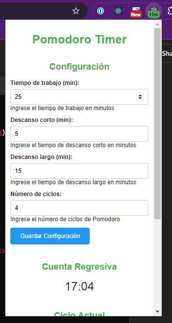
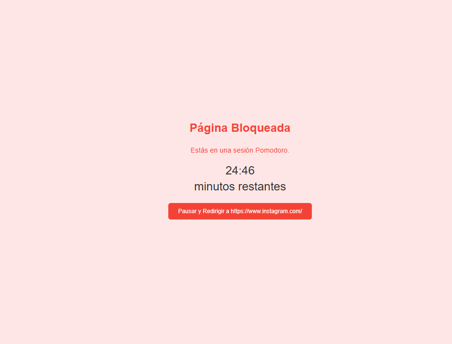

# Pomodoro Timer Chrome Extension


## Tabla de Contenidos

- [Introducción](#introducción)
- [Características](#características)
- [Capturas de Pantalla](#capturas-de-pantalla)
- [Instalación](#instalación)
- [Uso](#uso)
- [Configuración](#configuración)
- [Gestión de URLs Bloqueadas](#gestión-de-urls-bloqueadas)
- [Contribuciones](#contribuciones)
- [Licencia](#licencia)
- [Contacto](#contacto)

## Introducción

¡Bienvenido a la extensión de **Pomodoro Timer** para Chrome! Mejora tu productividad y gestiona tu tiempo de manera efectiva utilizando la Técnica Pomodoro. Esta extensión te ayuda a mantenerte enfocado al temporizar tus sesiones de trabajo y descansos, bloqueando sitios web distractores durante tus períodos de trabajo.

## Características

- **Temporizador Personalizable:** Configura tus duraciones preferidas para sesiones de trabajo, descansos cortos y largos.
- **Gestión de Ciclos:** Configura el número de ciclos Pomodoro que deseas completar en una sesión.
- **Bloqueo de URLs:** Bloquea sitios web específicos durante tus sesiones de trabajo para minimizar distracciones.
- **Pausar y Reanudar:** Pausa y reanuda fácilmente tu temporizador según sea necesario.
- **Detener y Reiniciar Ciclo:** Detén toda la sesión Pomodoro o reinicia únicamente el ciclo actual sin afectar el progreso general.
- **Persistencia de Datos:** Tus configuraciones y estados de sesión se guardan automáticamente, asegurando continuidad incluso si reinicias tu navegador.
- **Notificaciones:** Recibe notificaciones de escritorio para señalar el final de sesiones de trabajo y descansos.
- **Interfaz Amigable:** Interfaz de popup intuitiva con diseño accesible para una fácil navegación y control.

## Capturas de Pantalla


*Interfaz del Popup de Pomodoro Timer*


*Página Bloqueada con Temporizador de Cuenta Regresiva*

## Instalación

Sigue estos pasos para instalar la extensión Pomodoro Timer en tu navegador Chrome:

1. **Clonar el Repositorio:**

   ```bash
   git clone https://github.com/tu-usuario/pomodoro-timer-extension.git
   ```
2. **Navegar al Directorio de la Extensión:**

   ```bash
   cd pomodoro-timer-extension
   ```
3. **Abrir la Página de Extensiones de Chrome:**

   - Ve a `chrome://extensions/` en tu navegador Chrome.
   - Activa el **Modo de desarrollador** activando el interruptor en la esquina superior derecha.
4. **Cargar la Extensión Sin Empaquetar:**

   - Haz clic en el botón **"Cargar descomprimida"**.
   - Selecciona el directorio donde clonaste el repositorio.
5. **Verificar la Instalación:**

   - La extensión Pomodoro Timer debería aparecer ahora en tu lista de extensiones de Chrome.
   - Deberías ver el ícono de la extensión en la barra de herramientas de Chrome.

## Uso

1. **Abrir el Popup de la Extensión:**

   - Haz clic en el ícono de Pomodoro Timer en la barra de herramientas de Chrome para abrir la interfaz del popup.
2. **Configurar los Ajustes del Temporizador:**

   - **Tiempo de trabajo:** Configura la duración de tus sesiones de trabajo (por defecto es 25 minutos).
   - **Descanso corto:** Configura la duración de los descansos cortos (por defecto es 5 minutos).
   - **Descanso largo:** Configura la duración de los descansos largos (por defecto es 15 minutos).
   - **Número de ciclos:** Configura cuántos ciclos Pomodoro deseas completar en una sesión (por defecto es 4).
3. **Guardar Configuración:**

   - Después de configurar tus preferencias, haz clic en el botón **"Guardar Configuración"** para guardar tus ajustes.
4. **Iniciar una Sesión Pomodoro:**

   - Haz clic en el botón **"Play"** para iniciar tu sesión Pomodoro.
   - El temporizador comenzará a contar hacia atrás, y el badge mostrará el tiempo restante en minutos.
5. **Pausar/Reanudar el Temporizador:**

   - Haz clic en el botón **"Pausar"** para pausar el temporizador.
   - Haz clic nuevamente en el botón **"Play"** para reanudar el temporizador.
6. **Detener la Sesión:**

   - Haz clic en el botón **"Detener"** para finalizar la sesión Pomodoro actual completamente. Esto reiniciará el conteo de ciclos y eliminará cualquier bloqueo de URLs activo.
7. **Reiniciar el Ciclo Actual:**

   - Haz clic en el botón **"Reiniciar"** para reiniciar únicamente el ciclo actual (ya sea de trabajo o descanso) sin afectar el progreso general de la sesión.

## Configuración

Personaliza tu experiencia Pomodoro ajustando los parámetros del temporizador:

1. **Abrir el Popup de la Extensión:**

   - Haz clic en el ícono de Pomodoro Timer en la barra de herramientas de Chrome.
2. **Ajustar Duraciones del Temporizador:**

   - **Tiempo de trabajo (min):** Establece la duración de tus sesiones de trabajo.
   - **Descanso corto (min):** Establece la duración de los descansos cortos.
   - **Descanso largo (min):** Establece la duración de los descansos largos.
   - **Número de ciclos:** Establece la cantidad de ciclos Pomodoro por sesión.
3. **Guardar tus Preferencias:**

   - Después de realizar cambios, haz clic en **"Guardar Configuración"** para aplicar y guardar tus ajustes.

## Gestión de URLs Bloqueadas

Mantén tu enfoque gestionando la lista de sitios web que deseas bloquear durante las sesiones de trabajo.

### **Agregar una URL Bloqueada**

1. **Abrir el Popup de la Extensión:**

   - Haz clic en el ícono de Pomodoro Timer en la barra de herramientas de Chrome.
2. **Agregar URL:**

   - En la sección **"URLs Bloqueadas"**, ingresa la URL que deseas bloquear (por ejemplo, `facebook.com`) en el campo de entrada.
3. **Agregar:**

   - Haz clic en el botón **"Agregar"** para añadir la URL a la lista de bloqueadas.

### **Eliminar una URL Bloqueada**

1. **Abrir el Popup de la Extensión:**

   - Haz clic en el ícono de Pomodoro Timer en la barra de herramientas de Chrome.
2. **Eliminar URL:**

   - En la sección **"URLs Bloqueadas"**, encuentra la URL que deseas eliminar.
3. **Eliminar:**

   - Haz clic en el botón **"Eliminar"** junto a la URL correspondiente para removerla de la lista de bloqueadas.

## Contribuciones

¡Las contribuciones son bienvenidas! Si tienes sugerencias para mejoras o encuentras algún problema, no dudes en abrir un issue o enviar un pull request.

### **Cómo Contribuir**

1. **Fork del Repositorio:**

   - Haz clic en el botón **Fork** en la página del repositorio.
2. **Clonar tu Fork:**

   ```bash
   git clone https://github.com/tu-usuario/pomodoro-timer-extension.git
   ```
3. **Crear una Nueva Rama:**

   ```bash
   git checkout -b feature/nueva-funcionalidad
   ```
4. **Realizar los Cambios:**

   - Implementa tus características o arregla bugs.
5. **Commit de tus Cambios:**

   ```bash
   git commit -m "Descripción de los cambios realizados"
   ```
6. **Push a tu Fork:**

   ```bash
   git push origin feature/nueva-funcionalidad
   ```
7. **Abrir un Pull Request:**

   - Navega al repositorio original y haz clic en **"Compare & pull request"**.
   - Describe tus cambios y envía el pull request.

## Licencia

Este proyecto está licenciado bajo la [Licencia MIT](LICENSE).

## Contacto

Si tienes alguna pregunta, sugerencia o comentario, no dudes en ponerte en contacto:

- **Correo Electrónico:** tu-correo@example.com
- **GitHub:** [tu-usuario](https://github.com/tu-usuario)

---

*¡Gracias por usar la extensión Pomodoro Timer para Chrome! Esperamos que te ayude a mejorar tu productividad y gestionar tu tiempo de manera efectiva.*
